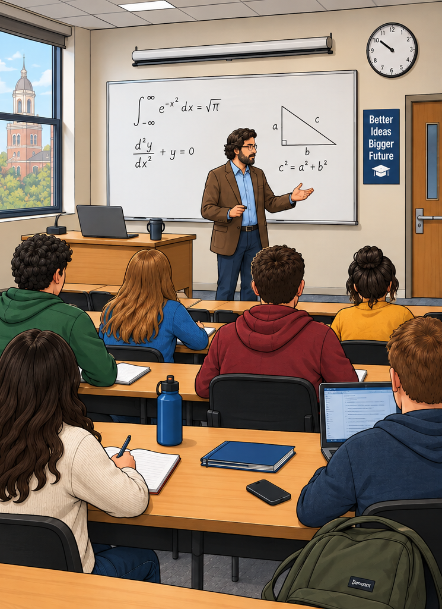
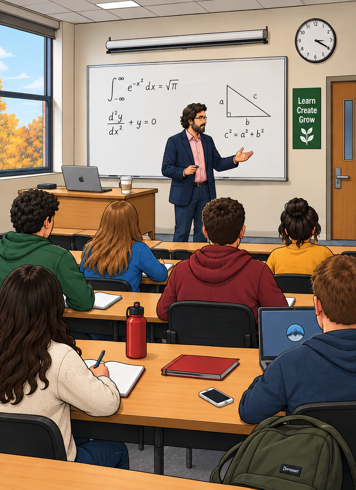
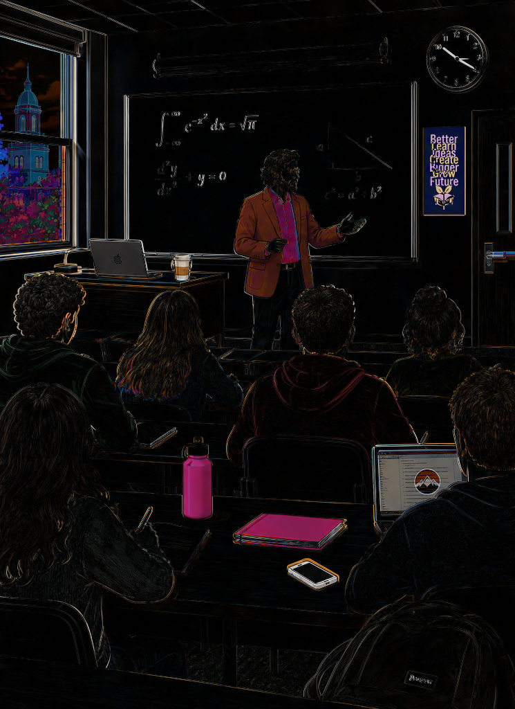
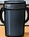
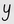
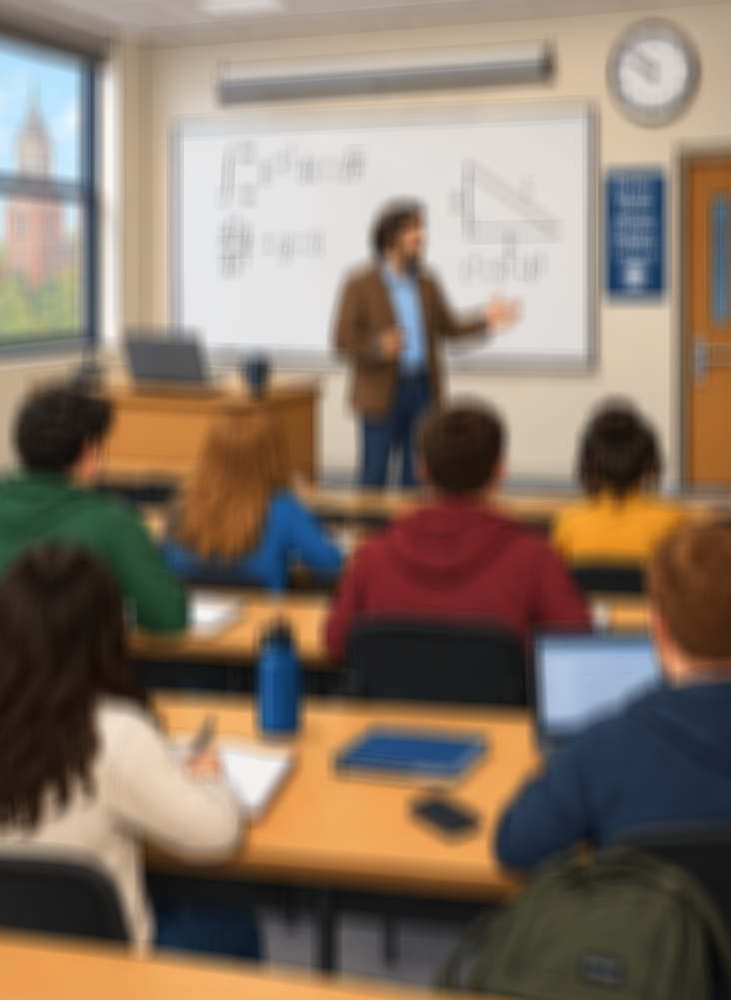
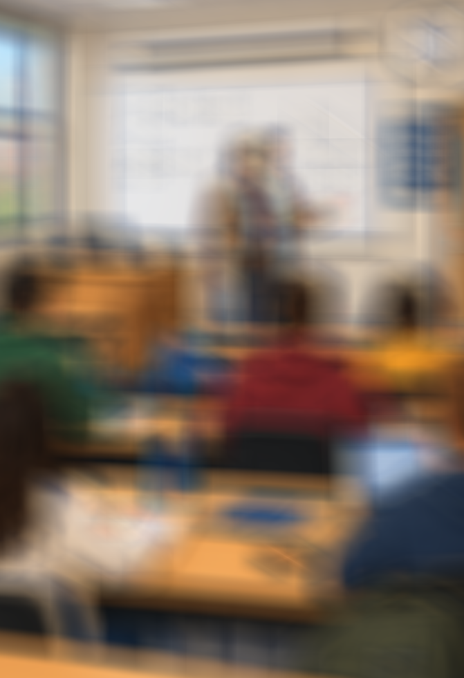
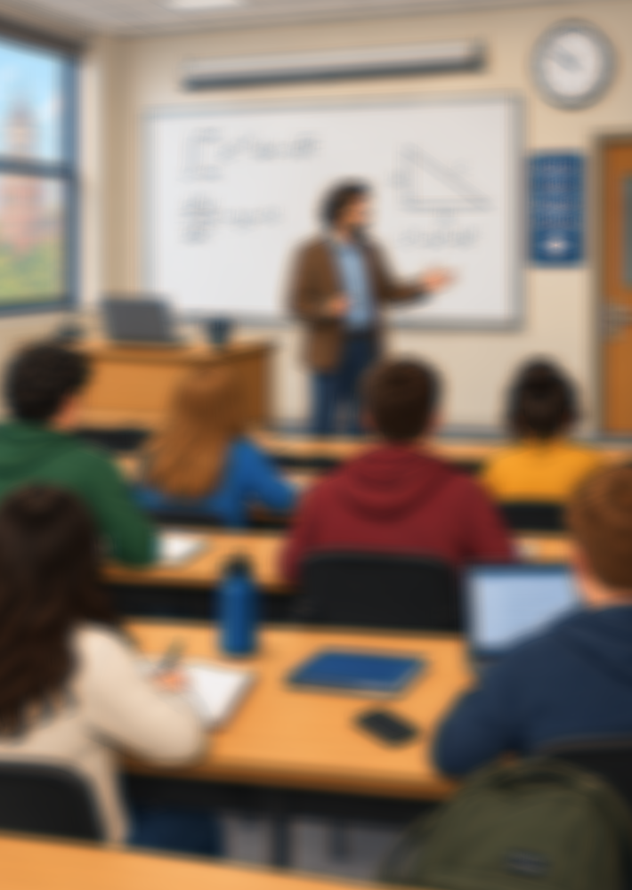
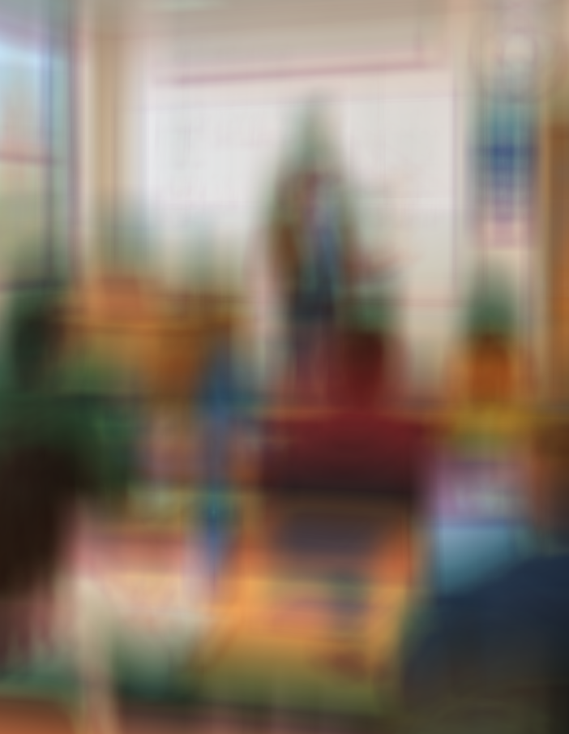

# Actividad 02 - Maching Learning
- Christian Marroquin
- Julian Medina Rosero
# Actividad
- Calcular la diferencia entre dos imagenes similares y encontrar cuales son sus diferencias.
## resultado

|imagen izquierda|imagen derecha|diferencia|
|-|-|-|
||||

- Calcular la convolucion de la imagen de la izquierda con los diferentes objetos.

|kernel|convolucion|
|-|-|
|||
|||
|||
|||
|||

- Realizar un mapa conceptual.

- El [codigo](src/main.c).
