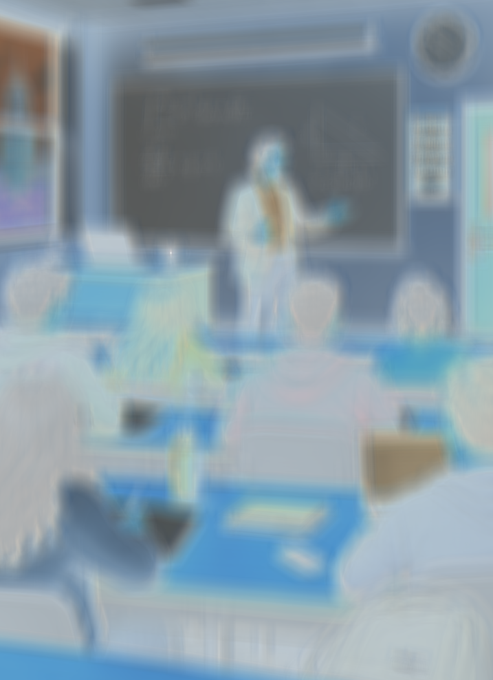
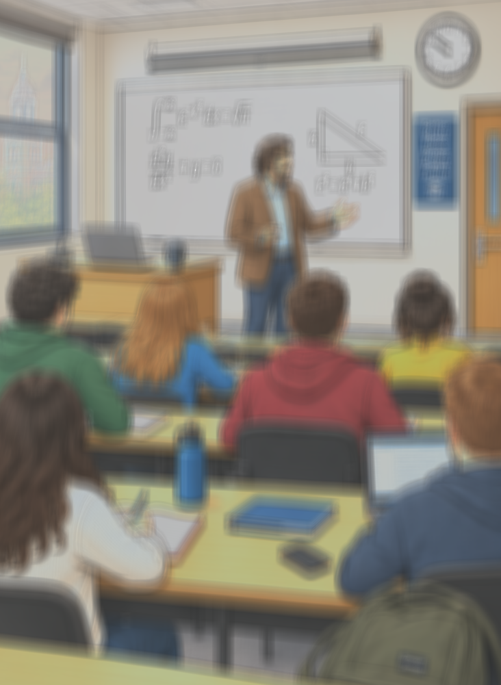
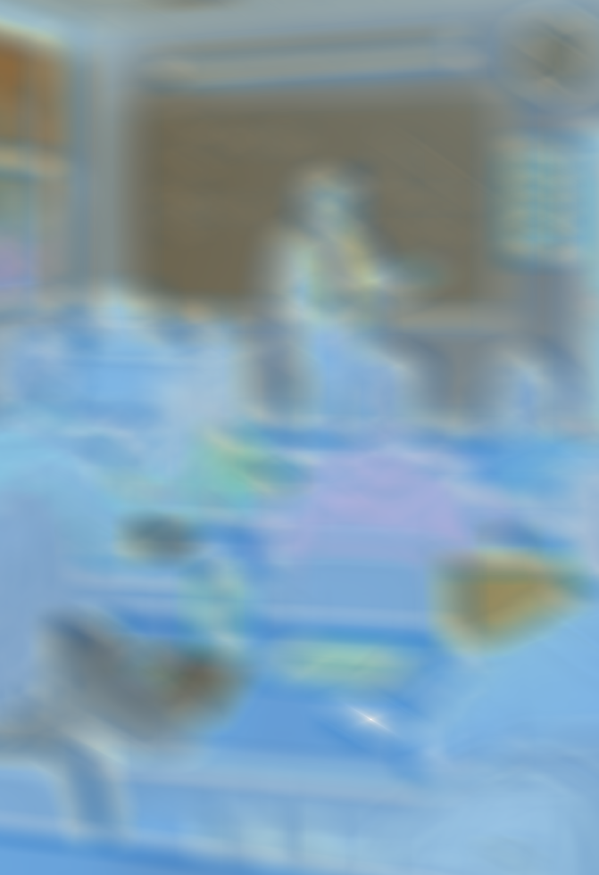
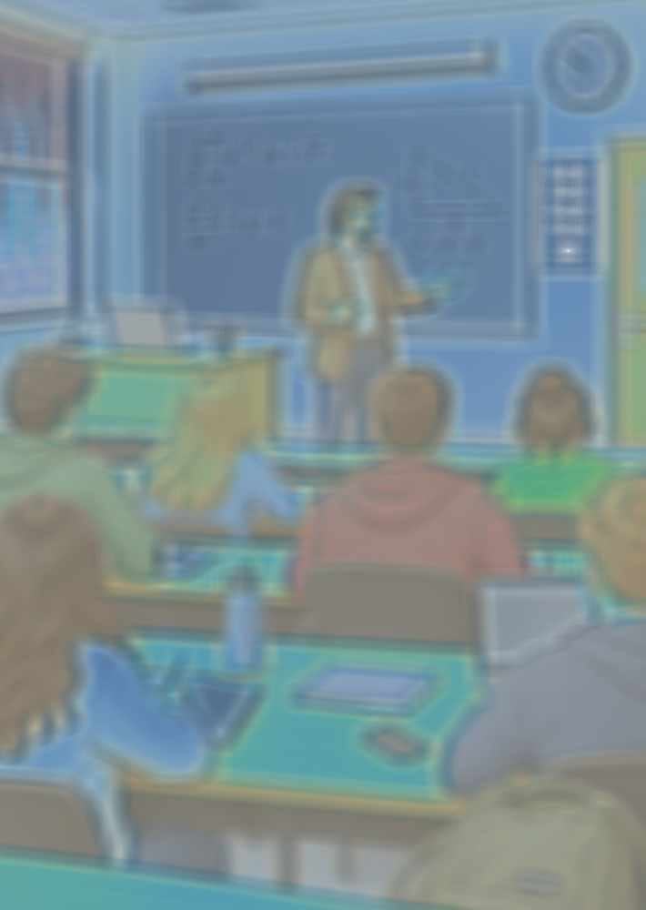
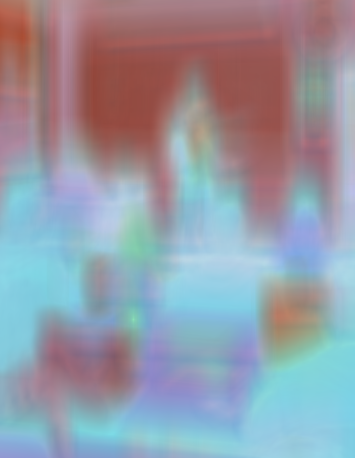
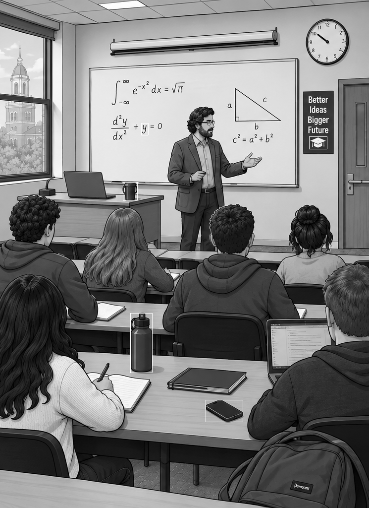

# Actividad 02 - Maching Learning
- Christian Marroquin
- Julian Medina Rosero
# Actividad
- Calcular la diferencia entre dos imagenes similares y encontrar cuales son sus diferencias.
## resultado

|imagen izquierda|imagen derecha|diferencia|
|-|-|-|
||||

- Calcular la convolucion de la imagen de la izquierda con los diferentes objetos.

|kernel|convolucion|
|-|-|
|||
|||
|||
|||
|||

Ademas de la tarea se hizo un metodo para encontrar los objetos en la imagen de la izquierda usando la desviacion estandar.

|kernel|desviacion estandar|lugar|
|-|-|-|
|||248,367|
|||285,248|
|||415,806|
|||624,275|
|||365,511|

Para la imagen a color el resultado de la busqueda es la siguiente:

y para la imagen en escala de grises es la siguiente:

- Realizar un mapa conceptual.

- El [codigo](src/main.c).
