# Actividad 02 - Maching Learning
- Christian Marroquin
- Julian Medina Rosero
# Actividad
- Calcular la diferencia entre dos imagenes similares y encontrar cuales son sus diferencias.
## resultado

|imagen izquierda|imagen derecha|diferencia|
|-|-|-|
||||

- Calcular la convolucion de la imagen de la izquierda con los diferentes objetos.

|kernel|convolucion|
|-|-|
|||
|||
|||
|||
|||

|kernel|desviacion estandar|lugar|
|-|-|-|
|||248,367|
|||285,248|
|||415,806|
|||624,275|
|||365,511|

- Realizar un mapa conceptual.

```mermaid
graph TD
    %% Nodos Principales
    A[Manejo de Imágenes mediante Matrices]
    
    B[1. Representación Matricial]
    B1[Estructura bidimensional: M x N]
    B2[Canales de Color]
    B1a[Filas = Alto / Columnas = Ancho]
    B1b[Píxel = Elemento A_ij]
    B2a[Escala de Grises: 1 canal 0-255]
    B2b[RGB: 3 canales R, G, B]
    B2c[RGBA: 4 canales + Transparencia]

    C[2. Operaciones Matriciales]
    C1[Transformaciones Puntuales]
    C2[Filtros y Convolución]
    C3[Transformaciones Geométricas]
    C1a[Brillo: Suma de constante]
    C1b[Contraste: Multiplicación escalar]
    C1c[Inversión: 255 - Píxel]
    C2a[Kernel / Máscara: Matriz K]
    C2b[Suma de productos ponderados]
    C2c[Ejemplos: Bordes, Desenfoque]
    C3a[Matrices de Transformación Afín]
    C3b[Rotación, Escalado, Traslación]

    D[3. Procesamiento Avanzado]
    D1[Dominio Frecuencial]
    D2[Álgebra Lineal Aplicada]
    D1a[Transformada Discreta de Fourier - DFT]
    D1b[Compresión y Filtrado de Ruido]
    D2a[Descomposición en Valores Singulares - SVD]
    D2b[Reducción de Dimensionalidad]

    %% Conexiones
    A --> B
    B --> B1
    B --> B2
    B1 --> B1a
    B1 --> B1b
    B2 --> B2a
    B2 --> B2b
    B2 --> B2c

    A --> C
    C --> C1
    C --> C2
    C --> C3
    C1 --> C1a
    C1 --> C1b
    C1 --> C1c
    C2 --> C2a
    C2 --> C2b
    C2 --> C2c
    C3 --> C3a
    C3 --> C3b

    A --> D
    D --> D1
    D --> D2
    D1 --> D1a
    D1 --> D1b
    D2 --> D2a
    D2 --> D2b

    %% Estilos
    classDef main fill:#2b5c8f,stroke:#1e3f63,stroke-width:2px,color:#fff,font-weight:bold;
    classDef section fill:#38761d,stroke:#275214,stroke-width:2px,color:#fff,font-weight:bold;
    classDef concept fill:#444,stroke:#222,stroke-width:1px,color:#fff;
    classDef detail fill:#222,stroke:#444,stroke-width:1px,color:#ddd;

    class A main;
    class B,C,D section;
    class B1,B2,C1,C2,C3,D1,D2 concept;
    class B1a,B1b,B2a,B2b,B2c,C1a,C1b,C1c,C2a,C2b,C2c,C3a,C3b,D1a,D1b,D2a,D2b detail;
```

- El [codigo](src/main.c).
